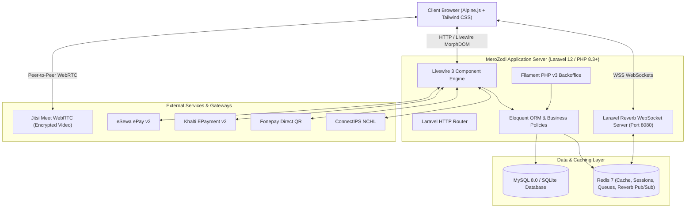
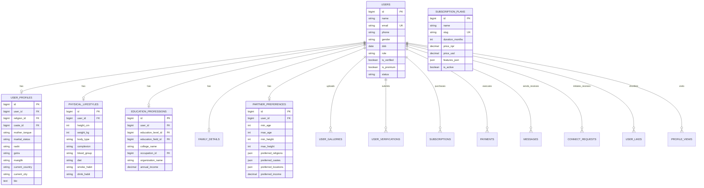

# PROJECT PLANNING & TECHNICAL SPECIFICATION
## Nepali Matrimonial & Matchmaking Platform (MeroZodi 2.0)
### Built with Laravel 12, Livewire 3, Alpine.js, Tailwind CSS, Reverb & Filament PHP v3

---

## Executive Overview & Specification Matrix

| Specification Key | Details |
| :--- | :--- |
| **Project Title** | **MeroZodi 2.0** - Next-Gen Matrimonial & Matchmaking Platform (`merozodi.com`) |
| **Architecture Pattern** | TALL Stack (Tailwind CSS, Alpine.js, Laravel 12, Livewire 3) + Reverb WebSockets |
| **Admin Panel** | Filament PHP v3 (Livewire 3 Engine, Resource Tables, KYC Queues, Analytics) |
| **Real-time WebSockets** | Laravel Reverb (High-speed, Self-hosted First-party WebSocket Server) |
| **Video Calling Engine** | Jitsi Meet WebRTC Integration (`meet.jit.si` / Dedicated WebRTC Bridge) |
| **Payment Gateway Suite** | eSewa ePay v2, Khalti EPayment v2, Fonepay Merchant QR, ConnectIPS |
| **Target Deployment** | Linux (Ubuntu 24.04 LTS) / Nginx / PHP 8.3+ / Redis / MySQL 8.0+ / Supervisor / Reverb Daemon |
| **Domain & Brand** | `merozodi.com` \| Version 2.0 Production Roadmap |

---

## 1. Executive Summary & Project Objectives

The primary objective of **MeroZodi 2.0** (`merozodi.com`) is to build a high-performance, real-time, culturally attuned matrimonial platform tailored for Nepali singles in Nepal and the global Nepali diaspora (USA, Australia, UK, Canada, UAE, Japan, etc.).

While traditional platforms suffer from sluggish legacy monoliths, exorbitant third-party SaaS subscriptions (Pusher, Twilio, SendBird), and lack of authentic cultural workflows, **MeroZodi 2.0** leverages modern reactive PHP technology to deliver sub-100ms user interactions, native search engine optimization (SEO), live WebSocket communication, encrypted video dating, and automated multi-gateway payment processing in Nepalese Rupees (NPR).

### 1.1 Core Strategic Goals
1. **High-Speed Reactive User Experience**: Instantaneous live search, filtering, and messaging using Livewire 3 and Alpine.js without full-page reloads or the architectural complexity of disconnected Single Page Application (SPA) REST APIs.
2. **Zero-Cost High-Concurrency WebSockets**: Eliminate recurring Pusher subscription fees by deploying Laravel Reverb directly on the server to power real-time chat, connection alerts, and instant profile notifications.
3. **Comprehensive Cultural Compatibility**: Support full Nepali matrimonial profiling, including caste/sub-caste hierarchies, astrology/horoscope (Rashi, Gotra, Manglik compatibility), family lineage, and overseas residency statuses.
4. **Seamless Local Monetization**: Automated subscription checkout with deep API integrations for Nepal's four leading payment systems: **eSewa**, **Khalti**, **Fonepay**, and **ConnectIPS**, with automated 13% VAT invoices.
5. **Rapid Administrative Operations**: Utilize Filament PHP v3 to provide an administrative operations panel for user KYC audits, manual verifications, advertisement banners, event management, and financial reporting.

---

## 2. System Architecture & Technology Stack

The system is designed around a unified monolith architecture utilizing the TALL stack, combining server-side security and performance with client-side reactive components.



### 2.1 Architectural Breakdown

| Layer | Technology | Role & Justification |
| :--- | :--- | :--- |
| **Backend Core** | Laravel 12 (PHP 8.3+) | Provides robust ORM (Eloquent), authentication, queues, job scheduling, rate limiting, and security middleware. |
| **Frontend Engine** | Livewire 3 + Alpine.js | Server-driven reactive DOM morphing with zero-latency client-side state handling for interactive components. |
| **UI Design System** | Tailwind CSS + DaisyUI | Utility-first design system with rich prebuilt accessible UI components, modals, drawers, and responsive controls. |
| **WebSocket Server** | Laravel Reverb | Official Laravel first-party WebSocket server capable of maintaining tens of thousands of concurrent real-time connections. |
| **Admin Operations** | Filament PHP v3 | Comprehensive admin panel built on Livewire 3 featuring table builders, form builders, chart widgets, and export tools. |
| **Video Conferencing**| Jitsi Meet External API | WebRTC-powered peer-to-peer 1-on-1 virtual dating rooms without third-party recurring server fees. |
| **Database & Cache** | MySQL 8.0 / SQLite + Redis 7 | Relational database with indexing for matrimonial searches and Redis for caching, sessions, and queues. |
| **File Storage** | Laravel Storage (Local / AWS S3)| Encrypted storage for citizenship/verification documents and public CDN-backed storage for user galleries. |

> [!NOTE]
> **Livewire 3 vs. Traditional Vue/React SPA Advantage**: By utilizing Livewire 3, MeroZodi eliminates the burden of maintaining two disconnected schemas (Frontend TypeScript/Vuelidate models vs. Backend Eloquent/FormRequests). Form validations, business policies, and database operations execute in a single unified PHP environment while delivering instantaneous real-time reactivity to the end user.

---

## 3. Complete Database Schema & Data Models

The relational database schema is structured into normalized domain tables to support rich cultural matching, subscription management, security moderation, and real-time interaction logs.



### 3.1 Domain Schema Catalog

| Table Name | Key Columns | Functional Description |
| :--- | :--- | :--- |
| `users` | `id, name, email, phone, password, gender, dob, role, is_verified, is_premium, status, created_at` | Core user credentials, authentication flags, verified trust status, and role-based access. |
| `user_profiles` | `id, user_id, religion_id, caste_id, mother_tongue, marital_status, rashi, gotra, manglik, current_country, current_city, bio` | Primary matrimonial, geographic, and astrological data attributes. |
| `physical_lifestyles` | `id, user_id, height_cm, weight_kg, body_type, complexion, blood_group, diet, smoke_habit, drink_habit` | Physical appearance, diet habits, and lifestyle preferences. |
| `education_professions` | `id, user_id, education_level_id, education_field_id, college_name, occupation_id, organization_name, annual_income` | Academic background and career information. |
| `family_details` | `id, user_id, father_name, father_profession, mother_name, brothers_count, sisters_count, family_type, family_values` | Lineage, siblings, and family cultural standing. |
| `partner_preferences` | `id, user_id, min_age, max_age, min_height, max_height, preferred_religions, preferred_castes, preferred_locations, preferred_income` | Criteria used by the mutual matching and notification engine. |
| `user_galleries` | `id, user_id, image_path, is_profile, is_cover, is_private, is_approved` | Profile photo albums with administrative moderation flags. |
| `connect_requests` | `id, sender_id, receiver_id, status (pending/accepted/rejected), created_at` | Connection requests lifecycle tracking. |
| `user_likes` | `id, liker_id, liked_id, created_at` | Shortlisted and liked profile tracking. |
| `profile_views` | `id, viewer_id, viewed_id, view_count, last_viewed_at` | Auditing of profile views and visitor feeds. |
| `messages` | `id, sender_id, receiver_id, message, type (text/image/system), is_read, read_at` | Real-time chat communication storage. |
| `video_call_sessions` | `id, caller_id, callee_id, room_name, status (initiated/ended/rejected), duration_seconds` | 1-on-1 virtual video date session logs. |
| `subscription_plans` | `id, name, slug, duration_months, price_npr, price_usd, features_json, is_active` | Tiered packages (Free, Silver, Gold, Platinum). |
| `subscriptions` | `id, user_id, plan_id, start_date, end_date, is_active, auto_renew` | Active member subscription tracking. |
| `payments` | `id, user_id, subscription_id, gateway, transaction_id, amount, tax_amount, status, raw_response` | Financial transactions for eSewa, Khalti, ConnectIPS, and Fonepay. |
| `user_verifications` | `id, user_id, document_type, document_front, document_back, status (pending/approved/rejected)` | KYC and National ID verification audit queue. |
| `user_reports` & `blocked_users` | `id, reporter_id, reported_id, reason, details / id, user_id, blocked_user_id` | Trust, safety, and member blocking lists. |

---

## 4. Detailed Functional Features & Workflows

### 4.1 Multi-Step Onboarding & Registration Wizard
A 5-step interactive Livewire wizard guides new members through profile creation with progressive client-side validation, ensuring high completion rates:
- **Step 1: Account & Core Demographics** – Full Name, Email/Phone, Secure Password, Gender, Date of Birth, and Current Living Location.
- **Step 2: Cultural, Caste & Horoscope Details** – Religion, Caste, Sub-Caste, Mother Tongue, Marital Status, Horoscope Rashi (Aries to Pisces), Gotra, and Manglik status.
- **Step 3: Physical Lifestyle & Habits** – Height in feet/inches or cm, Weight, Body Type, Complexion, Blood Group, Diet Type (Veg/Non-Veg), Smoking and Drinking habits.
- **Step 4: Education, Profession & Income** – Education Level (Bachelors, Masters, PhD, etc.), Faculty/Field of Study, College Name, Employment Sector (Govt/Private/Business), Occupation Title, and Annual Income range.
- **Step 5: Family Details, Bio & Photo Upload** – Parents' occupation, Sibling counts, Family values (Traditional/Moderate/Liberal), About Me bio, and Avatar photo crop/upload.

### 4.2 Five-Tier Search & Matchmaking Engine
The discovery engine offers five tailored search algorithms to accommodate different user preferences:
1. **Quick Basic Search**: Instant filtering by Age range, Height range, Religion, Caste, and City.
2. **Custom Multi-Criteria Search**: Granular filtering across education level, occupation, annual income brackets, diet, manglik compatibility, and family values.
3. **Mutual Match Engine**: Automated two-way matching algorithm where Candidate Profile attributes match the User's Partner Preferences **AND** the User's attributes match the Candidate's Partner Preferences.
4. **Reverse Search**: Discovers profiles whose ideal partner criteria specifically match the logged-in user's profile attributes.
5. **Saved Search Queries**: Allows premium members to save complex query parameters and receive automated daily/weekly email notifications when matching profiles register.

### 4.3 Real-Time Chat & Video Dating Suite
- **Instant Messaging (Laravel Reverb)**: High-performance WebSocket chat with message delivery receipts, typing indicators, read status updates, and Alpine.js emoji picker integration.
- **Encrypted Video Calling (Jitsi Meet)**: 1-on-1 virtual matrimonial meetings generated dynamically in dedicated secure rooms (e.g., `merozodi_room_{hash}`). Includes audio/video toggles, screen sharing, and connection duration timers.
- **Live Interaction Badges**: Real-time badge counters for incoming Connection Requests, Profile Likes, and Profile Views.

---

## 5. Nepali Payment Gateways Integration Architecture

MeroZodi 2.0 incorporates native integrations for Nepal's four leading digital payment providers with server-to-server cryptographic verification, idempotency checks, and automated 13% VAT tax receipt generation:

| Payment Provider | Protocol & Security | Integration Workflow |
| :--- | :--- | :--- |
| **eSewa (ePay v2)** | HMAC-SHA256 Signature Verification | Client submits encoded payload (`amount`, `tax_amount`, `product_code`, `signature`). Post-payment callback verifies HMAC signature against secret key before activating subscription. |
| **Khalti (EPayment v2)** | REST API Initiation & Verification | Server calls Khalti `/epayment/initiate/` to obtain `pidx` and `payment_url`. After user authorization, server verifies transaction status via `/epayment/lookup/`. |
| **Fonepay Direct** | Merchant Dynamic QR & Web Checkout | Generates merchant payment requests for bank mobile apps. Verifies transaction via server-side Fonepay verification webhook and secret hash. |
| **ConnectIPS** | NCHL Gateway Interoperability | Direct inter-bank account debit for high-value annual packages. Employs PKCS#12 digital certificate signing for request authorization. |

---

## 6. Administrative Operations (Filament PHP v3)

The administrative backoffice is powered by **Filament PHP v3**, providing an enterprise-grade backoffice interface with zero frontend overhead:

- **User Management & KYC Audit Queue**: Searchable, filterable user directory with inline status toggling (Active, Banned, Suspended). Dedicated review screen for National ID / Citizenship card verification with zoomable document inspection and 1-click Approval / Rejection with automated email notices.
- **Advertisement & Promo Banner Engine**: Create and schedule homepage hero sliders, sidebar banner placements, target URLs, click-through-rate (CTR) counters, and start/expiration schedules.
- **Matrimonial Events & Speed-Dating Manager**: Full event lifecycle management: event banners, registration quotas, pricing, schedules, participant lists, and per-event FAQ accordions.
- **CMS & Blog Management**: Rich-text blog editor for matrimonial articles, relationship tips, success stories, and legal page editors (About Us, Privacy Policy, Terms & Conditions, Safety Center).
- **Financial Analytics & Revenue Widgets**: Live metric cards displaying Daily Active Users (DAU), Monthly Recurring Revenue (MRR), VAT Collected, conversion rates by payment gateway, and exportable CSV/Excel reports.

---

## 7. Phased Implementation Roadmap & Timeline

The project is organized into an 8-phase execution plan spanning 16 weeks from inception to production launch:

| Phase / Weeks | Milestone Focus | Deliverables & Key Tasks |
| :--- | :--- | :--- |
| **Phase 1 (W1–W2)** | Environment Setup, Schema & Authentication | Install Laravel 12, Livewire 3, Tailwind CSS, DaisyUI. Run database migrations, configure User models, roles, permissions, and basic auth. |
| **Phase 2 (W3–W4)** | Profile Management & Multi-Step Wizard | Build 5-step registration wizard, profile edit interfaces, avatar upload/crop, photo gallery management, and KYC upload portal. |
| **Phase 3 (W5–W6)** | Matchmaking Algorithms & Discovery Engine | Develop Quick Search, Custom Search, Mutual Search, Reverse Search, Saved Searches, and category landing pages with instant Livewire filtering. |
| **Phase 4 (W7–W8)** | Real-time Messaging & Video Calling | Configure Laravel Reverb WebSocket server. Build 1-on-1 real-time chat with Alpine emoji picker. Integrate Jitsi Meet video dating rooms. |
| **Phase 5 (W9–W10)** | Payment Gateways & Subscriptions | Implement eSewa ePay v2, Khalti EPayment v2, Fonepay, and ConnectIPS. Build subscription management, automated renewals, and VAT invoices. |
| **Phase 6 (W11–W12)** | Filament Admin Dashboard & Moderation | Build Filament v3 resources: User KYC audit, banner ads, matrimony events, event FAQs, blog CMS, and financial reports. |
| **Phase 7 (W13–W14)** | Security Hardening, SEO & Quality Assurance | Perform rate-limiting configuration, XSS/CSRF audits, automated Pest/PHPUnit testing, profile privacy testing, mobile responsive testing, and SEO metadata tuning. |
| **Phase 8 (W15–W16)** | Production Deployment & Launch | Provision production server (Ubuntu 24.04, Nginx, PHP-FPM 8.3, Redis, MySQL 8, Supervisor for Reverb/Queues), SSL setup, backup automation, and go-live. |

---

## 8. Production Infrastructure & Deployment Topology

To sustain high concurrency and real-time WebSocket traffic, the production server is configured with dedicated daemons monitored by Supervisor:

1. **Web Server**: Nginx with HTTP/2 and SSL/TLS termination (Let's Encrypt / Cloudflare). Nginx reverse-proxies standard HTTP requests to PHP-FPM and WebSocket requests (`/app/...`) directly to Laravel Reverb on port 8080.
2. **Process Supervision (Supervisor)**: Manages four independent worker daemons:
   - `php artisan reverb:start --port=8080` (WebSocket server)
   - `php artisan queue:work --queue=default,high,emails` (Background queues)
   - `php artisan schedule:run` (Automated cron scheduler)
   - `php artisan pulse:check` (Real-time performance monitoring)
3. **Database & In-Memory Store**: MySQL 8.0 tuned with InnoDB buffer pools for profile indexing, paired with Redis 7.0 for session management, cache locks, and Reverb pub/sub broadcasting.
4. **Media & CDN Strategy**: Profile photos and KYC verification images processed with Intervention Image (auto-compression, WebP format conversion, watermarking) and served with aggressive cache headers.

---

## 9. Local Development & Installation Quickstart

To run **MeroZodi** locally on your development machine:

```bash
# 1. Clone repository
git clone https://github.com/shahimahesh4/merozodi.git
cd merozodi

# 2. Install PHP & Node Dependencies
composer install
npm install

# 3. Setup Environment
cp .env.example .env
php artisan key:generate

# 4. Migrate & Seed Database
php artisan migrate:fresh --seed --force

# 5. Build Frontend Assets
npm run build

# 6. Start Development Servers (Concurrent Artisan, Vite & Reverb)
composer run dev
```

### Default Seeded Admin Credentials:
- **URL**: `http://localhost:8000/admin`
- **Email**: `admin@merozodi.com`
- **Password**: `password`

---

*Document Sign-Off & Baseline Specification: MeroZodi 2.0 (merozodi.com)*
